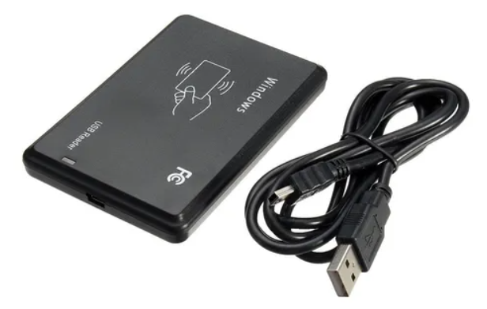
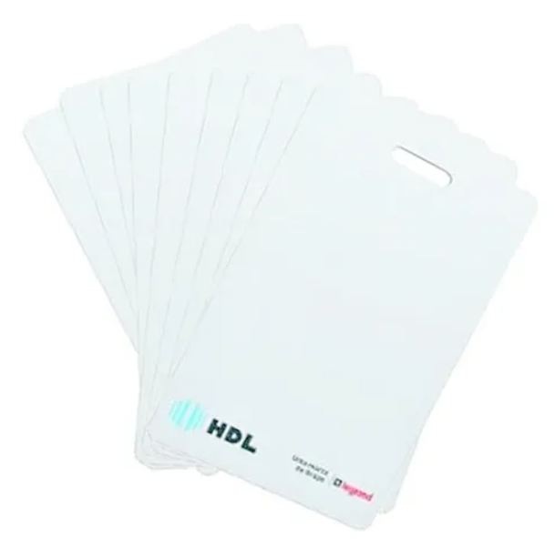

<h2>Leitura de cartões RFID utilizando Javascript</h2>
  

<h4>Equipamentos utilizados:</h4>

    Leitor Usb Para Tags E Cartões De 125khz, marca 3i

  

    Cartões Hdl Legrand Rfid 125hz Controle De Acesso Id-3

  